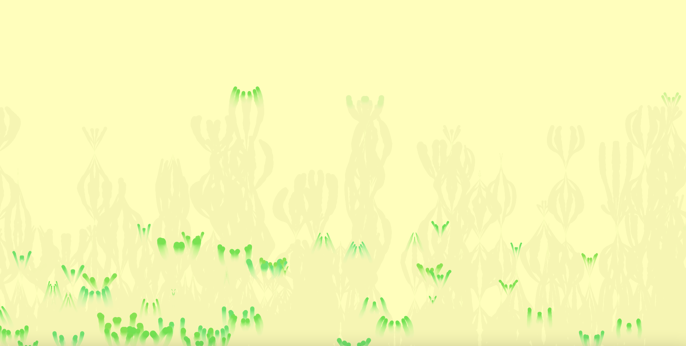

# Plantes numériques
## Flamme

*Plantes numériques* est une installation créée pour mon projet de **DNSEP**.  
Elle présente plusieurs générateurs de plantes virtuelles qui évoluent sur des cercles au sol, 
animée en P5.js.  
Parmi elles, **Flamme** s’inspire du mouvement des flammes 
et montre comment une plante numérique peut continuer à « vivre » dans l’espace de l’installation, 
contrairement aux plantes réelles.

Visuel du code : https://editor.p5js.org/celinesurlalune/full/sP1W96vKw

